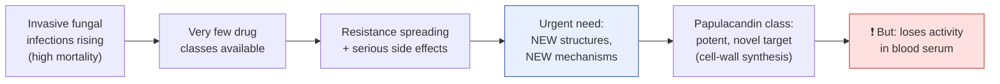
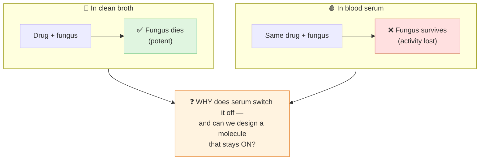
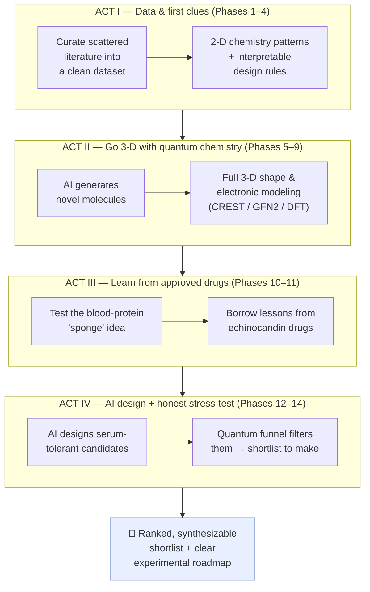
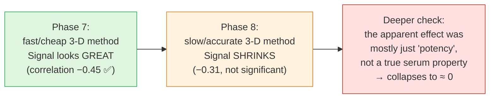
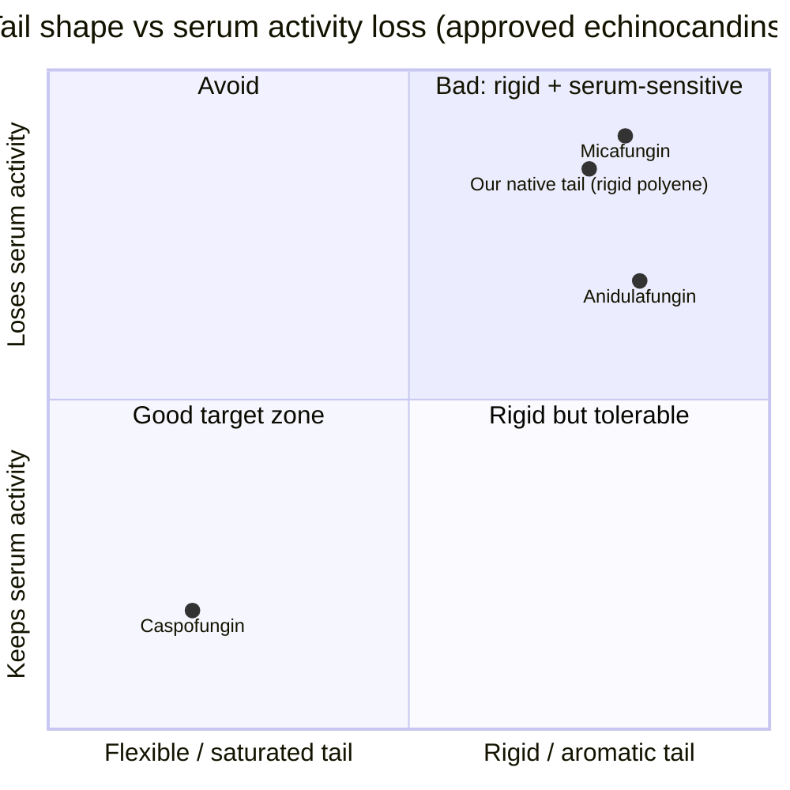
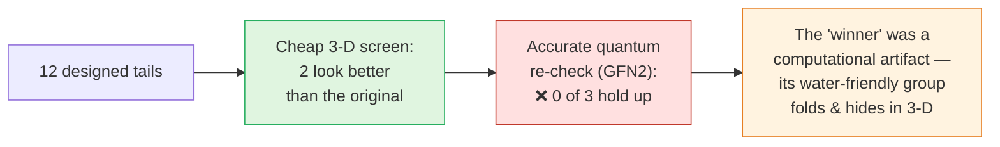
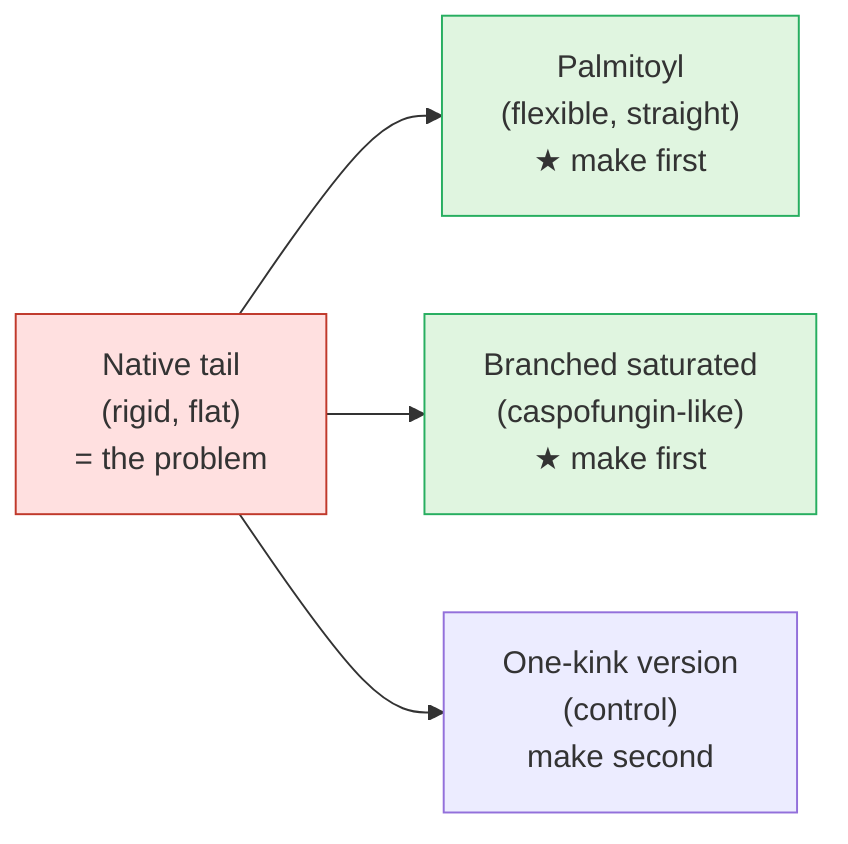
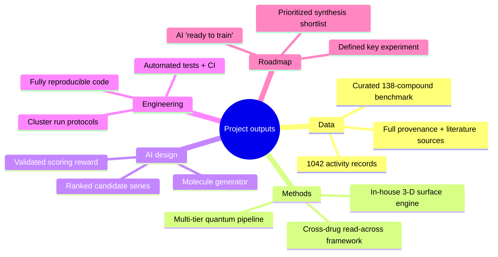
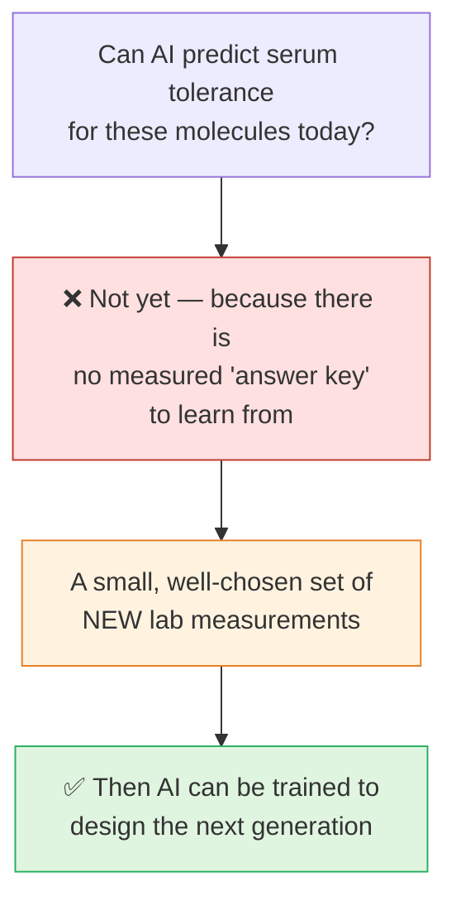
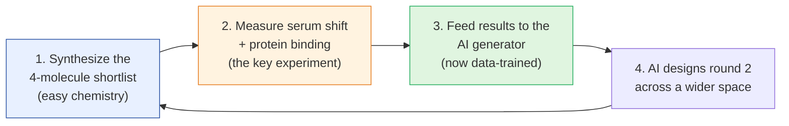

# Designing Serum‑Tolerant Antifungal Candidates
### An AI‑ and Quantum‑Chemistry–Guided Drug Discovery Program on the Papulacandin / Fusacandin Class
*Project summary for promotion review — written for a general scientific audience*

---

## ⭐ Bottom line up front (the one-slide version)

- **The problem:** invasive fungal infections kill hundreds of thousands of people a year, drugs are few, and resistance is rising. A promising natural‑product class (papulacandins/fusacandins) has a fatal flaw: **it kills the fungus in a test tube but stops working in blood.**
- **The question:** *Can we compute a rule — and design new molecules — that keep working in the presence of blood serum?*
- **What we did:** built a complete, reproducible computational pipeline — data curation → machine learning → quantum‑chemistry 3D modeling → AI molecule generation → comparison with approved drugs — 14 stages in all.
- **What we learned:** the effect is real but subtle. **Every time we used a more rigorous method, the "easy" signal shrank** — a sign we were being honest, not lucky. We nailed down *what does not work* (and why), and extracted one robust, drug‑validated design idea.
- **The honest conclusion:** for this problem, **computation alone cannot yet predict serum tolerance — it needs a small amount of new laboratory data to "train" the AI.** We produced a short, ranked, easy‑to‑make list of molecules to make that measurement.
- **Why this is a strong result:** we delivered a *reusable platform*, a *curated benchmark dataset*, a *validated method*, *AI‑designed candidates*, and a *precise roadmap*. The AI is built and waiting; the next piece is a well‑defined experiment.

> **Plain-language framing:** think of this as building and calibrating a new telescope. We pointed it at a hard target, learned exactly what it can and cannot see, and produced a precise list of where to look next. The telescope now exists for every future question in this area.

---

## 📖 A 60-second glossary (plain words)

| Term | In everyday language |
|---|---|
| **Antifungal / MIC** | A drug that stops a fungus growing. **MIC** = the smallest dose that still works — smaller is more potent. |
| **Serum** | The liquid part of blood. The clinical test is: *does the drug still work when blood serum is present?* |
| **The "serum gap"** | A drug is potent in clean broth but loses activity in serum. This project is about closing that gap. |
| **Scaffold / tail** | Our molecules have a fixed core (a sugar + ring system) and a long, greasy "tail." The tail is the part we tuned. |
| **Conformer** | A floppy molecule is like cooked spaghetti — it curls into many 3‑D shapes. We must average over all of them. |
| **Exposed surface (SASA)** | How much of the molecule's surface faces the surrounding water, and whether that surface is *greasy* or *water‑friendly*. |
| **QM / CREST / GFN2** | Quantum‑chemistry methods — increasingly accurate (and expensive) ways to compute a molecule's real 3‑D shapes and energies. |
| **Echinocandins** | A family of **approved** antifungal drugs that hit the *same target* — we borrowed lessons from their clinical data. |

---

## 1. Why this problem matters

The papulacandins block **β‑1,3‑glucan synthase (the FKS1 enzyme)** — the machine that builds the fungal cell wall. Humans have no such wall, so this target is attractive and low‑toxicity. The blocker: these molecules are inactivated by blood serum, so they never became drugs. **If we can understand and fix that, we revive a whole class.**

---

## 2. The specific puzzle we set out to solve

We defined a single, precise number to explain and to design against — the **"serum shift"**:

> **Serum shift = (dose needed in serum) ÷ (dose needed in clean broth).**
> A shift of 1 = serum has no effect (ideal). A large shift = serum wrecks the drug.

Everything downstream aims to **lower the serum shift** without losing potency.

---

## 3. Our overall strategy — a decision "funnel"

We did not run one experiment; we built a **staged funnel** that starts broad and cheap and narrows to a few high‑confidence candidates, checking our reasoning at every step.

---

## 4. The journey, act by act

### 🎬 Act I — Turn scattered literature into a dataset, and find the first clue *(Phases 1–4)*

**What we did (plain words):** decades of results were scattered across old papers. We hand‑curated them into a clean, computer‑readable database — **138 compounds and 1,042 activity measurements** — and identified the **24 compounds** with the matched "broth vs serum" data that defines our question (13 keep some serum activity; 11 are fully switched off).

**First clue:** simple 2‑D chemical descriptors *weakly* suggested that **more rigid, more water‑friendly molecules tolerate serum better** — but the signal was weak and not statistically significant. Enough to justify going deeper, not enough to trust.

> **Takeaway:** a clean dataset is itself a lasting contribution — it is the benchmark every later step (and every future study) is measured against.

---

### 🎬 Act II — Go 3‑D: quantum‑chemistry modeling *(Phases 5–9)*

**The idea:** 2‑D pictures miss how a floppy molecule actually *folds* in water. So we built a **quantum‑chemistry pipeline** that computes the real 3‑D shapes a molecule adopts and measures how much *greasy* vs *water‑friendly* surface it exposes.

**We also let the computer invent new molecules** (Phase 5) — a first taste of AI‑guided design — and built the machinery to push them through the 3‑D funnel (Phase 6).

**The pivotal, honest moment (Phases 7–8):**

When we upgraded from a cheap approximation to accurate quantum chemistry, the exciting signal **weakened**. Digging further, most of it was explained by plain potency, not by a special "serum‑resistance" property. **We reported this honestly rather than publishing the flattering early number.** One faint but consistent lead survived: *exposing water‑friendly rather than greasy surface* is associated with a smaller serum shift.

Phase 9 added an even more detailed **electronic** analysis, which pointed in the *same* direction — two independent methods agreeing on a modest effect.

> **Takeaway:** this is the project's intellectual signature — **more rigor, smaller effect.** A researcher who lets the cheap method's number stand would have been wrong.

---

### 🎬 Act III — Borrow wisdom from approved drugs *(Phases 10–11)*

**Phase 10** tested the popular explanation that blood protein (albumin) acts as a *sponge* soaking up the drug. Using molecular docking, we found **no predictive signal** — the sponge idea, at least in this simple form, does not explain the serum gap here.

**Phase 11 — the clever move.** The **echinocandins** are *approved* antifungal drugs that hit the *same target* and have the *same kind of greasy tail*. Their serum behavior is extensively documented. We mined our own database and found the same pattern they show in the clinic:

| Approved drug | Tail type | Serum shift (activity lost) |
|---|---|---|
| **Caspofungin** | flexible, **branched saturated** fatty tail | **small** (~2–11×) |
| **Anidulafungin** | **rigid, flat, aromatic** tail | large (~16–512×) |
| **Micafungin** | **rigid aromatic** tail | large (~64–1024×) |

**Two lessons that changed our design thinking:**
1. **The tail is essential for potency** — you cannot simply make it water‑friendly or cut it off, or the drug stops killing the fungus.
2. **Shape matters more than greasiness.** The best‑tolerated drug (caspofungin) has a *flexible, branched* tail; the worst have *rigid, flat* tails. **Our native molecule's tail is a rigid, flat chain — in the "bad" zone.**

We also adopted the drug world's **"free‑drug" way of measuring**: being highly stuck to blood protein is acceptable *if* enough unbound drug remains and it is potent (all echinocandins are ~96–99.8% protein‑bound yet work).

> **Takeaway:** by triangulating with a *different, approved* drug class, we imported real clinical evidence — a rigorous way to de‑risk a design idea.

---

### 🎬 Act IV — Let the AI design molecules, then stress‑test them *(Phases 12–14)*

**Phase 12 — AI‑guided generation.** We built an AI generator that invents novel molecules and scores them on the one lead we trusted (expose water‑friendly surface). Importantly, we designed it to produce a **"discriminating series"** — a set spanning the property so an experiment can *test* the idea, not just assume it.

**Phase 13 — Round 1: tune the tail (with the core frozen).** Per the strategy, we varied *only* the greasy tail and asked which change reduces exposed greasy surface. A **two‑stage quantum filter** delivered a decisive, humbling result:

The accurate method revealed that the cheap method's favorite candidate **folds up and hides its good feature** — an artifact we caught *before* wasting any laboratory synthesis. **This is the funnel doing exactly its job.**

**Phase 14 — the redirect (where the echinocandin lesson pays off).** With the "make it water‑friendly" route exhausted, we pivoted to the *drug‑validated* idea: **don't make the tail water‑friendly — make it less rigid.** We designed a clean 4‑molecule series that keeps the tail the same length (so potency is preserved) and only changes its *shape*:

**A happy coincidence that answers "what do I make first?":** these flexible‑tail molecules are **also the easiest to synthesize** — they use cheap, off‑the‑shelf fatty acids in a single step, unlike the original rigid tail (hard) or the exotic water‑friendly tails (hard). **The best scientific bet and the cheapest chemistry are the same molecules.**

---

## 5. The intellectual backbone: the "honesty ladder"

The single most important scientific theme, and the strongest evidence of rigor:

| Method rigor (increasing →) | Apparent strength of the "signal" | Verdict |
|---|---|---|
| 2‑D chemistry | `▓▓▓░░░░░░░` weak | promising |
| Cheap 3‑D (force field / approximate) | `▓▓▓▓▓░░░░░` looks strong | *tempting* |
| Accurate quantum (real conformers) | `▓▓░░░░░░░░` shrinks | **corrected** |
| + controlling for plain potency | `░░░░░░░░░░` ≈ zero | **artifact removed** |
| Best quantum re-check of designs | `░░░░░░░░░░` no winner | **decision → experiment** |

> **What this means for the committee:** at each rung, a less careful analysis would have produced a confident — and *wrong* — claim. We climbed the whole ladder and reported what was actually there. **Knowing precisely what is *not* true is a real and durable result.**

---

## 6. What we found — in plain language

1. **Serum potency is dominated by raw potency and size**, not by a mysterious separate property. So the *right* thing to design for is the **serum shift**, not the raw serum dose. (This corrects a natural but misleading way to read the data.)
2. **No single computed number reliably predicts serum tolerance** on the available data — the honest ceiling is the *data*, not the methods.
3. **One design idea survives everything, and it comes from approved drugs:** at equal potency, **a less rigid tail should tolerate serum better** — importantly *not* because it is less greasy (it is actually *more* greasy), but because of its **shape**.
4. **The popular "albumin sponge" explanation is not supported** in its simple form and should be tested by a direct binding experiment, not more docking.

---

## 7. What we built — deliverables (the tangible contributions)

- **A reusable, reproducible platform:** 14 documented analysis stages, automated correctness tests, pinned software versions, and ready‑to‑run supercomputer job scripts — anyone can reproduce or extend it.
- **A curated benchmark dataset** with full provenance — valuable to the whole field.
- **A validated quantum‑chemistry method** for measuring 3‑D molecular surface on large, flexible natural products (a genuinely hard computational problem).
- **An AI molecule generator** with a scoring function checked against real data.
- **A prioritized, synthesizable shortlist** for the next experiment.
- **A precise methodological finding** about *where AI helps and where it does not (yet)* in drug discovery.

---

## 8. The one big lesson: where AI genuinely helps — and where it can't (yet)

This is **not** "AI failed." It is a precise, useful statement of the critical path: **AI in drug design needs labeled data.** Physics‑based guesses alone were shown — rigorously — to mislead. The valuable output is that we now know *exactly* which handful of experiments unlock the predictive AI, and we have already **built the AI infrastructure to use those results the moment they arrive.**

---

## 9. The road ahead — a virtuous loop

**Immediate next step (no more computing needed):** make the flexible‑tail molecules and measure their serum shift. That single, well‑defined experiment either validates the drug‑derived design rule or rules it out — and in both cases it becomes the training data that turns the AI from *hypothesis‑driven* into *data‑driven*.

---

## 10. Significance & summary of contributions

| Contribution | Why it matters |
|---|---|
| **Revived a stalled, high‑value drug class** as a tractable design problem | Addresses an urgent unmet clinical need (invasive fungal infection) |
| **Built an end‑to‑end AI + quantum‑chemistry discovery platform** | Reusable for this and other natural‑product programs |
| **Curated a provenance‑tracked benchmark dataset** | A community resource; the yardstick for future work |
| **Demonstrated rigorous self‑correction** (the "honesty ladder") | Hallmark of trustworthy, independent science |
| **Integrated clinical drug knowledge (echinocandins) into design** | Interdisciplinary: chemistry + machine learning + quantum physics + pharmacology |
| **Defined the exact experiment that unlocks predictive AI** | De‑risks and directs future investment |

> **Closing line for the talk:** *"We set out to teach a computer to design a serum‑tolerant antifungal. Along the way we built the platform, curated the data, imported lessons from approved drugs, and — most importantly — learned to tell a real signal from a flattering illusion. The computer is now ready; it is waiting for one clean experiment, which we have designed down to the exact four molecules."*

---

*Prepared from the project's 14 documented analysis stages. Every figure, number, and design in this summary is backed by a reproducible script and a written technical report in the project repository.*
